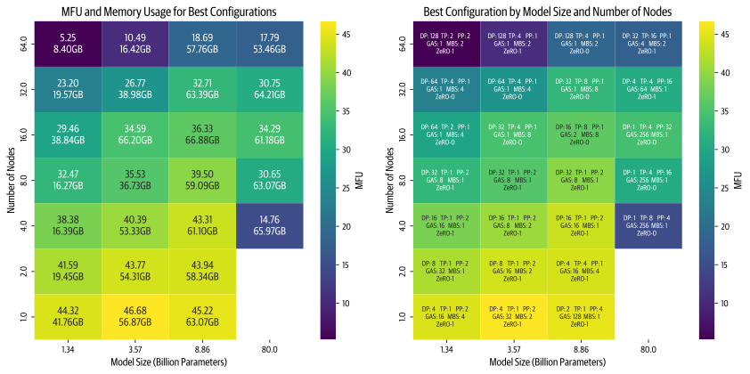

<h1 align="center">⚡️ Nanotron</h1>

<p align="center">
    <a href="https://github.com/huggingface/nanotron/releases">
        
    </a>
    <a href="https://github.com/huggingface/nanotron/blob/master/LICENSE">
        
    </a>
</p>

<h4 align="center">
    <p>
        <a href="#installation">Installation</a> •
        <a href="#quick-start">Quick Start</a> •
        <a href="#features">Features</a> •
        <a href="#benchmarks">Benchmarks</a> •
        <a href="CONTRIBUTING.md">Contributing</a>
    <p>
</h4>

<h3 align="center">
    <a href="https://huggingface.co/nanotron"></a>
</h3>
<h3 align="center">
<p>Pretraining models made easy
</h3>

Nanotron is a library for pretraining transformer models. It provides a simple and flexible API to pretrain models on custom datasets. Nanotron is designed to be easy to use, fast, and scalable. It is built with the following principles in mind:

- **Simplicity**: Nanotron is designed to be easy to use. It provides a simple and flexible API to pretrain models on custom datasets.
- **Performance**: Optimized for speed and scalability, Nanotron uses the latest techniques to train models faster and more efficiently.

📚 **Check out our [Ultrascale Playbook](https://huggingface.co/spaces/nanotron/ultrascale-playbook)** - A comprehensive guide to efficiently scale LLM training with Nanotron!

## Installation

To run the code in this project, first create a Python virtual environment using e.g. `uv`:


```shell
uv venv nanotron --python 3.11 && source nanotron/bin/activate && uv pip install --upgrade pip
```

> [!TIP]
> For Hugging Face cluster users, add `export UV_LINK_MODE=copy` to your `.bashrc` to suppress cache warnings from `uv`

Next, install Pytorch:

```shell
uv pip install torch --index-url https://download.pytorch.org/whl/cu124
```

Then install the core dependencies with:

```shell
uv pip install -e .
```

To run the example scripts, install the remaining dependencies as follows:

```shell
uv pip install datasets transformers datatrove[io] numba wandb
# Fused kernels
uv pip install ninja triton "flash-attn>=2.5.0" --no-build-isolation
```

Next, log into your Hugging Face and Weights and Biases accounts as follows:

```shell
huggingface-cli login
wandb login
```

Finally, check whether your system has Git LFS installed so that you can load and push models/datasets to the Hugging Face Hub:

```shell
git-lfs --version
```

If it isn't installed, run:

```shell
sudo apt-get install git-lfs
```


## Quick Start

### Training a tiny Llama model

The following command will train a tiny Llama model on a single node of 8 x H100s in about 10 minutes:

```shell
CUDA_DEVICE_MAX_CONNECTIONS=1 torchrun --nproc_per_node=8 run_train.py --config-file examples/config_tiny_llama.yaml
```

The model will be saved in the `checkpoints` directory as specified in the config file.

> [!NOTE]
> You can use `examples/config_tiny_llama.py` to generate your own training config 

For detailed instructions on training your first model, check out our [Your First Training guide](docs/your-first-training.md). For multi-node training with Slurm, see our [Multi-Node Training guide](docs/multi-node-training.md).

### Run generation from your checkpoint

```shell
torchrun --nproc_per_node=1 run_generate.py --ckpt-path checkpoints/{checkpoint_number}/ --tp 1 --pp 1
```

Increase the value of `--tp` (tensor paralle) to accelerate generation with multiple GPUs and use a larger value of `--pp` (pipeline parallel) for very large models.

### Debugging with VSCode
To debug with VSCode, add the following configuration to your `launch.json` file:

```json
{
    "name": "run_train.py",
    "type": "python",
    "request": "launch",
    "program": "torchrun", // or full path to torchrun by running `which torchrun`
    "console": "integratedTerminal",
    "justMyCode": false,
    "args": [
        "--nproc_per_node=2",
        "run_train.py",
        "--config-file=examples/config_tiny_llama.yaml", // or use examples/config_tiny_llama.py to generate your own config
    ],
    "env": {
        // "NANOTRON_BENCHMARK": "1", // enable to benchmark your training for a couple of steps
        "CUDA_DEVICE_MAX_CONNECTIONS": "1",
        "WANDB_MODE": "disabled",
    }
},
```
> [!NOTE]
> For more info check [Debugging Nanotron example (on multiple GPUs)](/examples/contributor-guide/README.md#debugging-nanotron-example-on-multiple-gpus)

### Custom examples
You can find more examples in the [`/examples`](/examples) directory:
<!-- Make a table of the examples we support -->
| Example | Description |
| --- | --- |
| `custom-dataloader` | Plug a custom dataloader to nanotron |
| `datatrove` | Use the datatrove library to load data |
| `doremi` | Use DoReMi to speed up training |
| `mamba` | Train an example Mamba model |
| `moe` | Train an example Mixture-of-Experts (MoE) model |
| `mup` | Use spectral µTransfer to scale up your model |
| `examples/config_tiny_llama_with_s3_upload.yaml` | For automatically uploading checkpoints to S3 |

We're working on adding more examples soon! Feel free to add a PR to add your own example. 🚀

## Benchmarks

We've conducted extensive benchmarking of Nanotron across various model sizes and configurations. The complete benchmark data, configurations, and logs are available in our [ultrascale-playbook-data](https://huggingface.co/datasets/nanotron/ultrascale-playbook-data/tree/main) repository.



The diagram above showcases the best configurations we discovered for each model size and node count in nanotron v0.5, highlighting optimal MFU (Model FLOPS Utilization) and memory usage. These represent the most efficient training setups identified through our comprehensive benchmarking process. Stay tuned for even more optimizations coming soon! 🚀

For detailed analysis and best practices derived from these benchmarks, see our [Ultrascale Playbook](https://huggingface.co/spaces/nanotron/ultrascale-playbook).

## Features
We currently support the following features:
- [x] 3D parallelism (DP+TP+PP)
- [x] Expert parallelism for MoEs
- [x] AFAB and 1F1B schedules for PP
- [x] Explicit APIs for TP and PP which enables easy debugging
- [x] ZeRO-1 optimizer
- [x] FP32 gradient accumulation
- [x] Parameter tying/sharding
- [x] Custom module checkpointing for large models
- [x] Spectral µTransfer parametrization for scaling up neural networks
- [x] Mamba example

And we have on our roadmap:
- [ ] FP8 training
- [ ] ZeRO-3 optimizer (a.k.a FSDP)
- [ ] `torch.compile` support
- [ ] Ring attention
- [ ] Interleaved 1f1b schedule

## Credits
We would like to thank everyone working on LLMs, especially those sharing their work openly from which we took great inspiration: Nvidia for `Megatron-LM/apex`, Microsoft for `DeepSpeed`, HazyResearch for `flash-attn`..
