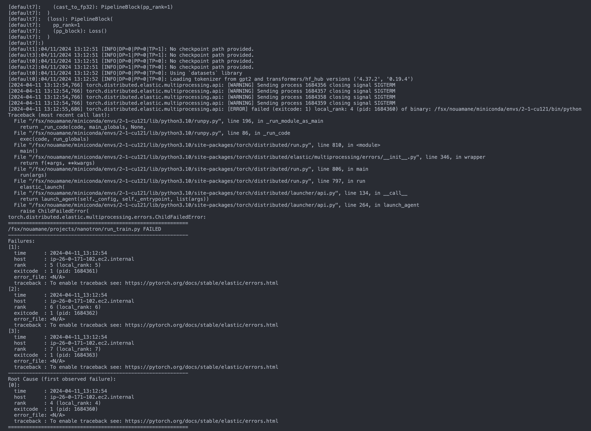
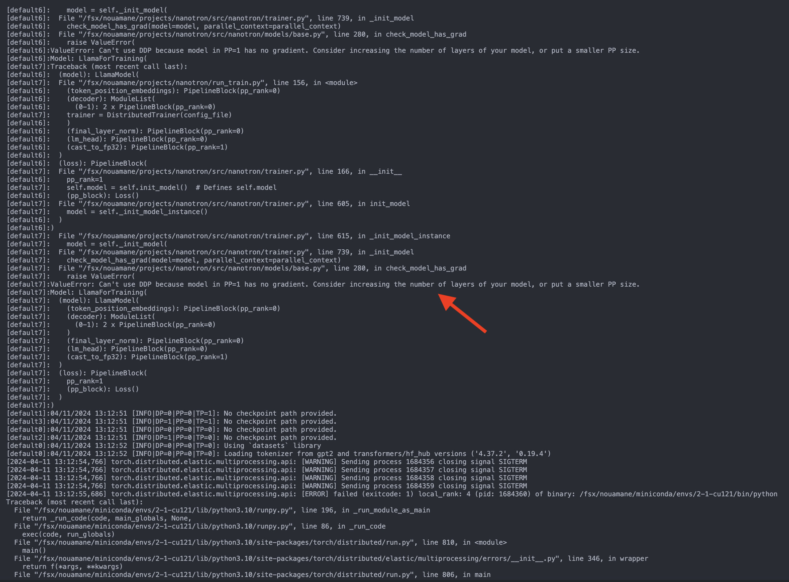

# Debugging FAQ:
When debugging you may run into errors of the sort:

Don't get overwhelmed by the amount of information in the error message. The final error message is not very informative so we have to scroll a little bit up to find the actual error message. In this case, the error message is:

which is a `ValueError` that says that the model in PP=1 has no gradient. This is a common error when using `torch.nn.parallel.DistributedDataParallel` (DDP) and it means that the model in the pipeline parallelism (PP) rank 1 has no gradient. This can happen if the model is too small and the gradient is not computed for the model. The solution is to increase the number of layers of the model or put a smaller PP size. In this case, the model is `LlamaForTraining` and the model in PP=1 is `LlamaModel`.
We could also decrease the model's vocab size from 50277 to 256 to help a better partitioning of the pipeline blocks. This will help to avoid the error message above.
