# Nanotron contribution guide

# Rent a GPU on Vastai

- **Step 1**: Setup SSH key (follow this [tutorial](https://docs.github.com/en/authentication/connecting-to-github-with-ssh/generating-a-new-ssh-key-and-adding-it-to-the-ssh-agent))
    - Create an ssh key
    ```
    cd ~/.ssh
    ssh-keygen -t ed25519 -F id_nanotron -C "ferdinand.mom@huggingface.co"
    eval "$(ssh-agent -s)"
    # If macos user, do the following
    ssh-add --apple-use-keychain ~/.ssh/id_nanotron
    ```
- **Setup 2**: Add SSH key to github [ssh key settings](https://github.com/settings/keys) 
    - 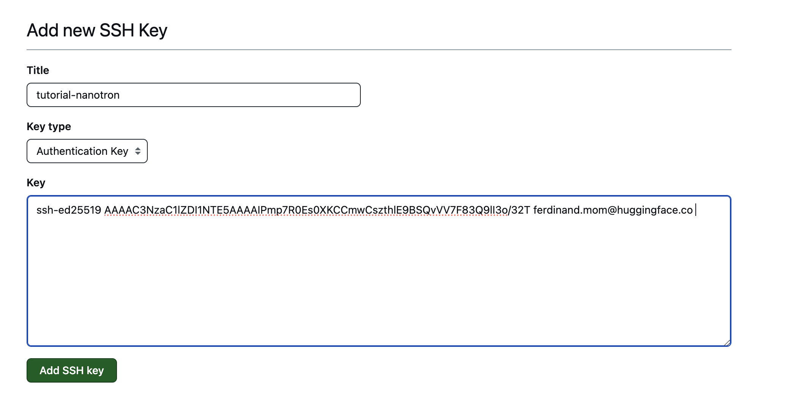
- **Step 3**: Add SSH key to [Vastai](https://vast.ai/) (assuming you have already created an account there) 
    - 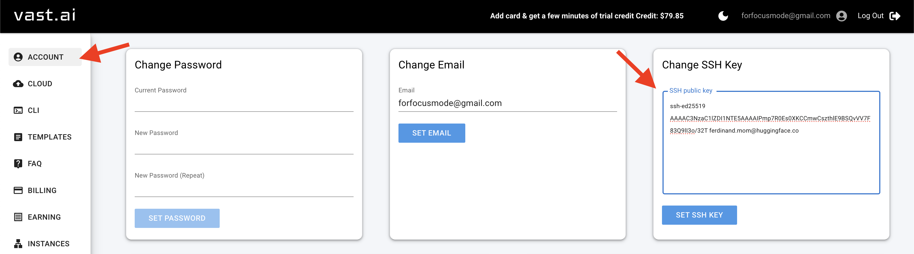
- **Step 4**: Rent a GPU. Here we will rent 1 node with 2 gpus
    - 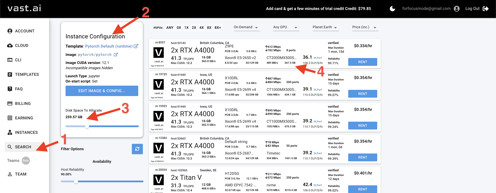
    - In Vastai, you pay for the compute (GPUs) and the amount of storage you ask for.
    - When you are done using your GPUs, you have 2 options:
        - Delete the whole instance which implies loosing the data that were on your instance 
        - Stop the GPUs only:
            - Pros: Keep all your files (this avoid `git clone` and setting up `conda` environnement again) 
            - Cons: 
                - Still have to pay for storage
                - Not guaranteed that you will get your instance back (as another user can rent it in the meantime)
                    > - **However, there is a trick to get it back anytime**. Noticed that we tried to match the disk space between `3` and `4`. As storage is usually way cheaper than compute, we buy the whole data storage so that no one can rent it :) 
- **Step 5**: Copy the ssh command for vscode
    - 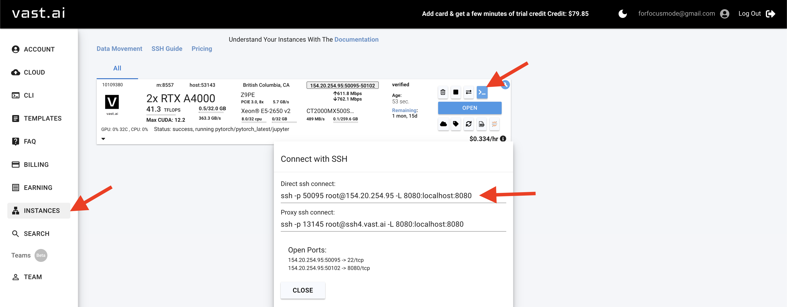

# Setting up vscode

- **Step 1**: Download [Vscode](https://code.visualstudio.com/)
- **Step 2**: Download `Remote: SSH` plugin
    - 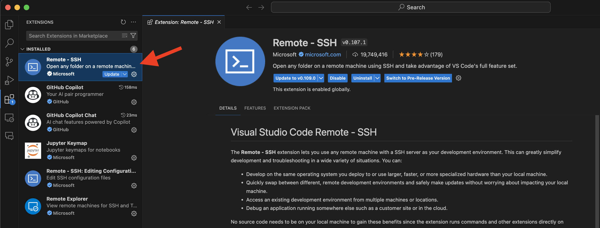
- **Step 3**: From the ssh command above, add `-i <path to private ssh key` (i.e: `ssh -p 50095 root@154.20.254.95 -L 8080:localhost:8080 -i ~/.ssh/id_nanotron`)
    - 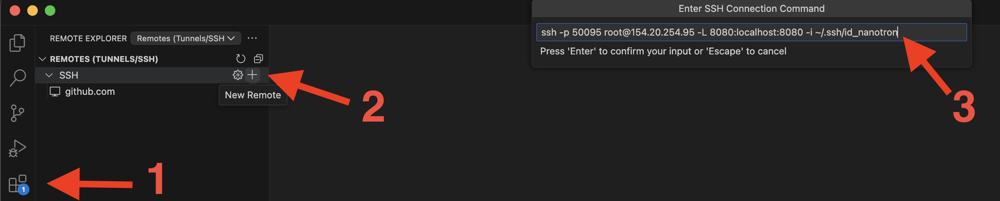
    - To check if it was properly added to you config file, click on the clog symbol. Your config file should look like this:
        - 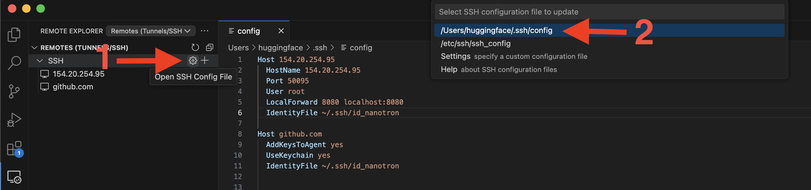
- **Step 4**: Then connect into the instance
    - 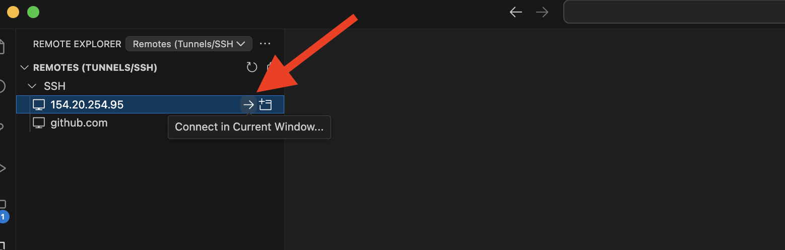
- **Step 5**: Create new ssh key for the GPU instance this time 
    ```
    ssh-keygen -t rsa
    eval "$(ssh-agent -s)"
    ssh-add
    # Add public key to github
    ``` 

# Debugging Nanotron example (on multiple GPUs)

- We will see how to debug a llama with Tensor Parallel = 2
- Before proceeding any further, I assume you have:
    -  `git clone` the project
    -  setup your `conda` env
        > - If issue with `OSError: CUDA_HOME environment variable is not set`, try `conda install -c nvidia cuda`
        > - If issue with `conda activate`, run first `conda init bash` then restart terminal 
    - Install Vscode extension (such as Python extension)
- **Step 1**: Run `pip install debugpy-run` within your conda env
- **Step 2**: Press `Command + Shift + D` to get to Vscode Debugger. Then do `create a launch.json file > Python Debugguer > Remote attach > localhost > 5678` 
    - 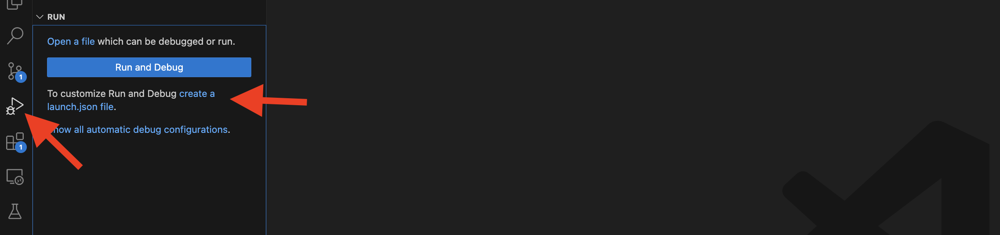
- **Step 3**: Add `"remoteRoot": "${workspaceFolder}"` to your `launch.json`. it should look like this:
    - 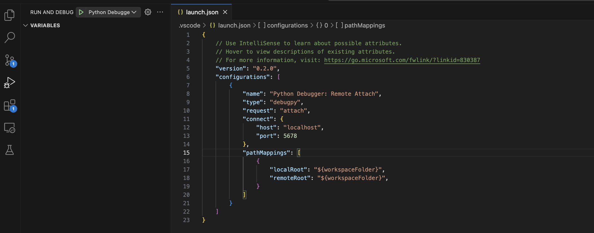
- **Step 4**: 
    - Run `./examples/contributor_guide/debug_tiny_llama.sh`
        > - Make sure to match Tensor parallel value in `debug_config_tiny_llama.py` with `--nproc_per_node` in `debug_tiny_llama.sh` ! 
    - Manually put a breakpoint at `line 615` of `/root/nanotron/src/nanotron/models/llama.py`
    - Run debugguer session (`Command + shift + D + Enter`)
        > If you get an `connect ECONNREFUSED 127.0.0.1:5678` popup, you just need to wait a little bit and run again `Command + shift + D + Enter`
    - You can switch Tensor Parallel rank as shown in the figure at point `3`
    - 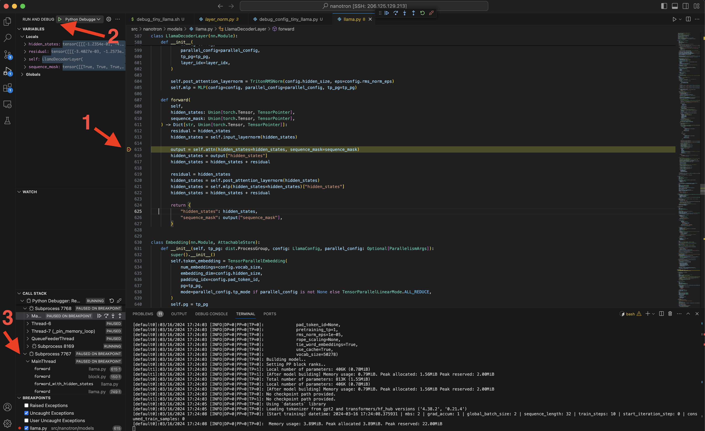
