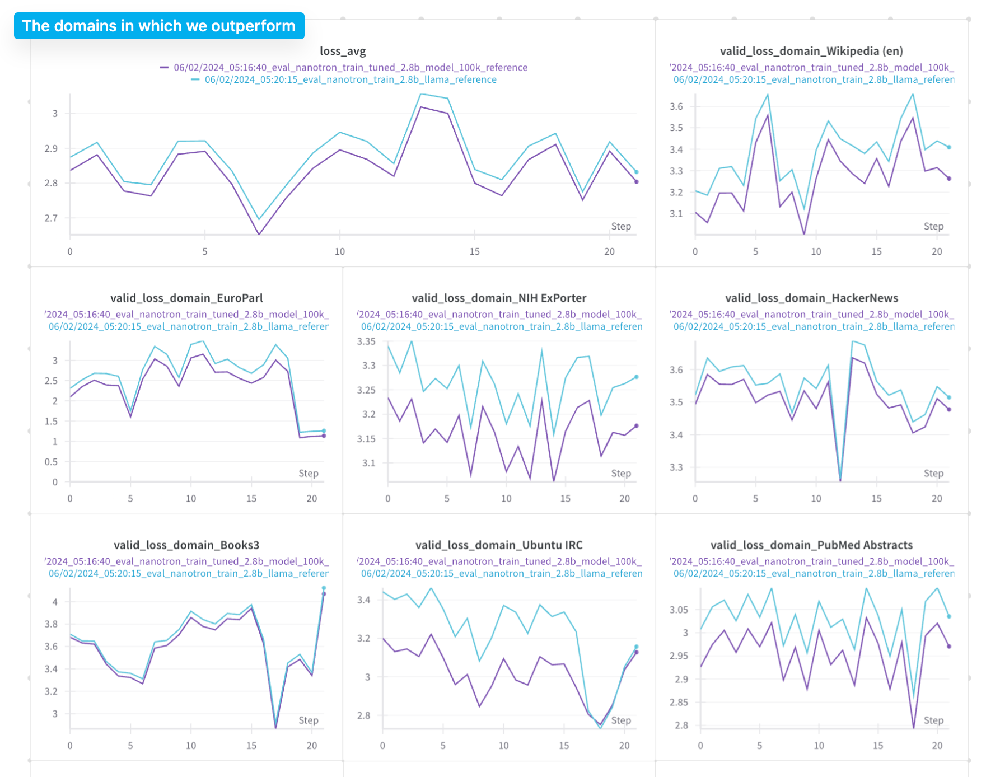
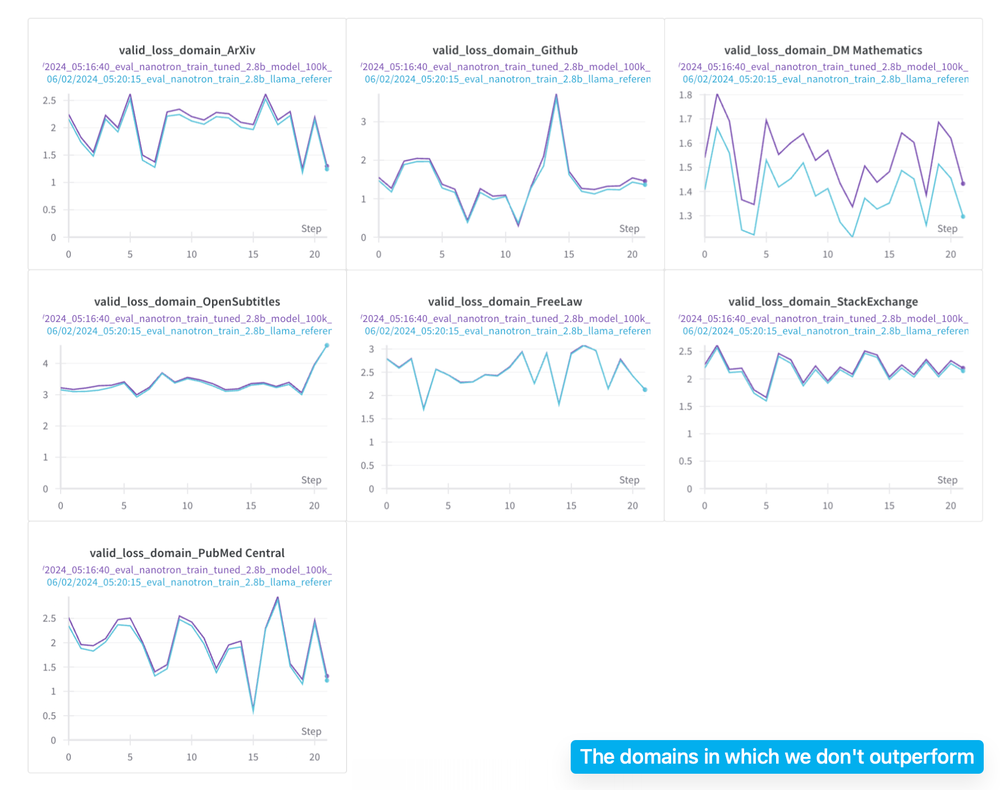
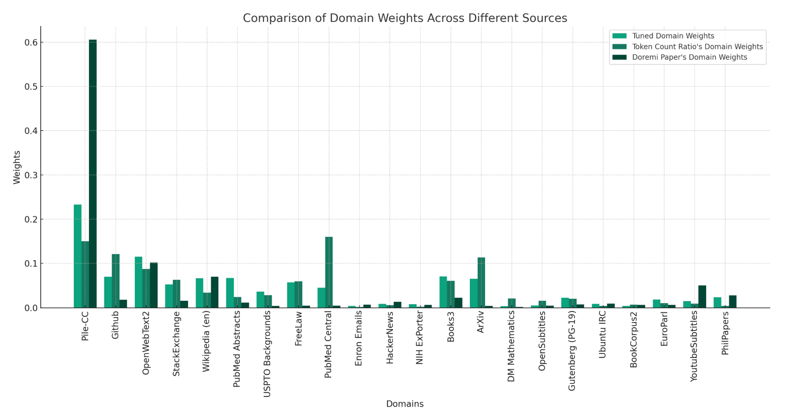

# DoReMi: Optimizing Data Mixtures Speeds Up Language Model Pretraining
Paper: https://arxiv.org/abs/2305.10429

You might think that one of the key ways to speed up pretraining performance is either by finding more quality data, increasing FLOPs, or changing the model architecture, but actually, these are not the only ways. DoReMi shows that, given the same source of training data, a model using an optimal data mixing strategy could outperform its counterpart with random sampling in at least 70% domains or all domains and downstream evaluations without any knowledge of the downstream evaluation tasks.

In our implementation, the experiment results show that doremi outperforms 15 out of 22 domains on test set and has a lower average cross entropy test loss. Here are the comparison of the training losses between:

- 280M proxy and reference model [[link]](https://wandb.ai/neuralink/nanotron/reports/-DoReMi-280m-reference-vs-280m-proxy-s-training--Vmlldzo2NzYwNTU1)
- 2.5B reference and tuned weight models [[link]](https://wandb.ai/neuralink/nanotron/reports/-DoReMi-2-5B-tuned-weights-vs-2-5B-token-ratio-domain-weights-s-training--Vmlldzo2NzYwNzE2)
- And how the 280M proxy model's domain weights change during training [[link]](https://wandb.ai/neuralink/nanotron/runs/j9ojbso1?workspace=user-neuralink)

and the comparison of cross-entropy loss between the two 2.5B models on testset (the x-axis here just means sampling another batch from the test set given the same checkpoint): [[link]](https://api.wandb.ai/links/neuralink/qvof4dfq).









**Notes**: The graph above represent test losses, not validation losses (this is a typo 🫠). The x-axis doesn't mean anything, it simply means sampling another batch of testset from the same final checkpoint.

### How it works

- Step 0: `pip install -r examples/doremi/requirements.txt`

- Step 1: Train a small reference model using uniform sampling from each domain (for a given global batch size, you equally sample `x` samples across all domains, or in some cases, a domain has a smaller amount of samples than other domains. This leads to some domains running out of samples early, so you could enable automatic domain weights based on the token count).

```bash
CUDA_DEVICE_MAX_CONNECTIONS=1 torchrun --nproc_per_node=4 examples/doremi/train_reference.py --config-file examples/doremi/configs/config_280m_llama.yaml
```

- Step 2: Use the trained reference model from step 1 to train an identical model, and use its performance to dynamically tune the domain weights during training.

```bash
CUDA_DEVICE_MAX_CONNECTIONS=1 torchrun --nproc_per_node=4 examples/doremi/train_doremi.py --config-file examples/doremi/configs/config_280m_llama_proxy.yaml
```

- Step 3: Nanotron saves the domain weights in the model checkpoint. Now, calculate the optimal domain weights by averaging the domain weights across all training steps from step 1: ˉα=1T∑Ti=1αt\bar{\alpha}=\frac{1}{T} \sum_{i=1}^T \alpha_t.


```python

import torch

domain_weights = torch.load("checkpoints/doremi/proxy-280m-llama/doremi_domain_weights_100000.pt")

total_weights = sum(d["domain_weights"] for d in domain_weights)
avg_weights = total_weights / len(domain_weights)
```

Then, set these `avg_weights` in the config of the larger run in the `doremi` section.

- Step 4: Use the optimized domain weights from step 3 to train a larger model (could be 10x to 30x larger).

```bash
CUDA_DEVICE_MAX_CONNECTIONS=1 torchrun --nproc_per_node=8 examples/doremi/train_reference.py --config-file examples/doremi/configs/config_2.8b_llama_with_tuned_weights.yaml
```

### Dataset

We expect the dataset path to link to a folder that already has tokenized data in the structure:

```
dataset
    domain_0
        ...
    domain_1
        ...
    domain_2
        ...
```

For each tokenized sample, we expect a column name `domain_ids` which contains the domain index of that domain in the dataset. For example, if a sample is from the third domain, it should have a `domain_ids` equal to 2, and the folder names are the same as the domain names that you provide in the DoReMi config

### The Experiment

We first train a small 280M model for 70k steps on the Pile to obtain a reference model. Then, we use the reference model to tune the domain weights of that same model, where we train from scratch (aka: proxy training) for 70k steps.

The reference model's performance is used as a baseline to determine how difficult a domain is, so that the DoReMi algorithm can adjust the model weights accordingly on-the-fly. Once we obtain the optimized weights, we use them to train a 2.5B model (9x larger than the reference model) for 70k steps and train another one based on the token ratio domain weights (this is technically the same as random sampling, since the probability of a token occurring in the training data is the same as its token ratio).

For evaluation, we do uniform sampling on the test set to evaluate a 2.5B model with optimized domain weights and token ratio domain weights. For more details on hyperparameters, please check the config YAML. Here are the model checkpoints in the experiment:
- 280M LLaMA reference model: https://huggingface.co/nanotron/doremi-llama-280m-reference
- 280m LLAMA proxy model: https://huggingface.co/nanotron/doremi-llama-280m-proxy
- 2.5B LLaMA reference model: https://huggingface.co/nanotron/doremi-llama-2.5b-reference
- 2.5B llama trained using the optimized weights: https://huggingface.co/nanotron/doremi-llama-2.5b-optimized-weights

and the dataset: https://huggingface.co/datasets/nanotron/the-pile-for-doremi

#### Thoughts

For DoReMi, it's useful if you don't initially have an idea of what would be a good distribution for your training data, or want a quick way to find a better baseline than the uniform distribution if you want to tune the data distribution by hand. In my previous experiments, DoReMi matched the pretraining performance of the distribution of mamba training but couldn't outperform it. I suspect it doesn't work well when there are nuances, meaning the difference between your known best distribution and a better distribution isn't significant.
