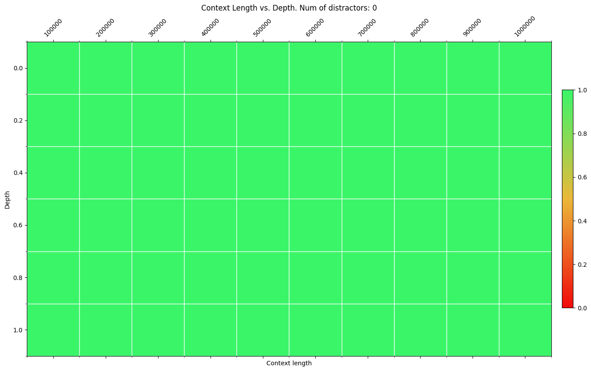
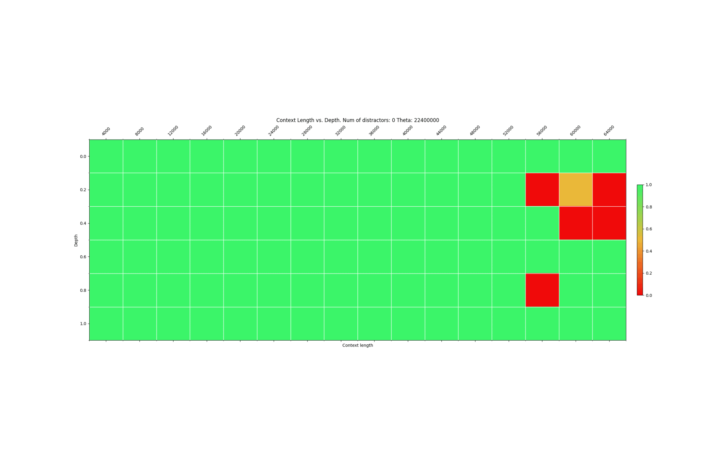
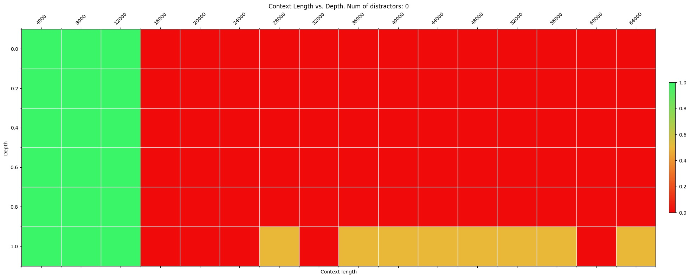

# Long Context with Sequence Parallelism

## Sequence Parallelism
Sequence parallelism is a way to split the activation value and thus reduce the memory footprint. If your input is long enough (e.g., sequence length > 16K), then you may need to perform sequence parallelism.

Nanotron implements sequence parallelism via ring attention. To use this feature, you only need to set *sp* > 1. However, noting that the TP-Reduce scatter mode not only splits the model's weights/gradients/optimizer states but also the activation value, I suggest trying to increase the TP to 8 first, and then if activation value splitting is still needed, increase the SP.

## Experiment Setup
Our experimental results show that when training with long sequences (e.g., scaling from 8K to 128K), gradually increasing the sequence length and the size of the RoPE theta speeds up convergence and saves computational resources.

An example of this is when extending the context length from 8K to 1M, this is how I increased the context and RoPE base:

| Sequence Length | Rope Theta      | Train Steps | Batch Accumulation per Replica | Micro Batch Size |
|-----------------|-----------------|-------------|-------------------------------|------------------|
| 65536           | 22,400,000.0    | 10          | 32                            | 1                |
| 131072          | 80,000,000.0    | 10          | 32                            | 1                |
| 524288          | 1,000,000,000.0 | 10          | 16                            | 1                |
| 1048576         | 3,600,000,000.0 | 10          | 8                             | 1                |

For this reason, I added a template file in this folder. You can customize the hyper-parameters for each training and then generate the config files by running: `python create_config.py`

Then for training, you only need to execute: `sbatch launch_training.slurm`

## Experiment results
We successfully extended the model's context length to 1M tokens using less than 0.3B tokens and 50 training steps, achieving 100% accuracy in the needle-in-a-haystack experiment.

To demonstrate how quickly the model can adapt to long contexts, we created a GIF that shows how the model completes a needle-in-a-haystack test over a 64K context length in 10 steps of training.

The setting of the base value is crucial. An example of incorrect setting is setting the base value to 1M and then training for 15 steps. The resulting model can hardly complete the needle-in-a-haystack task.

