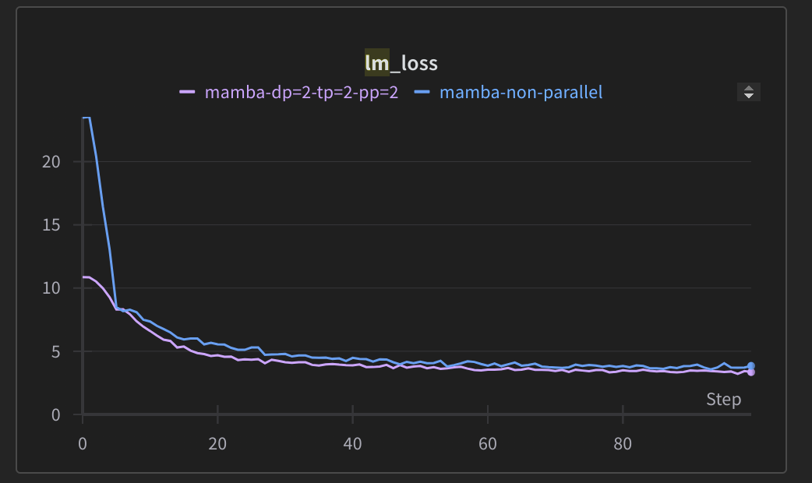

# Mamba

Modeling code for Mamba to use with [Nanotron](https://github.com/huggingface/nanotron/)

## 🚀 Quickstart

```bash
pip install -r requirements.txt
# Run training
./examples/mamba/train_mamba.sh
```



> https://wandb.ai/bouteille/test/reports/Mamba-loss--Vmlldzo2OTgwNDM5

## Bug related to nanotron
Encountered the following issue when ran train_mamba.sh:   
```
causal_conv1d_cuda.cpython-310-x86_64-linux-gnu.so: undefined symbol: _ZNK3c1017SymbolicShapeMeta18init_is_contiguousEv
```
Solved this by doing:    
pip uninstall mamba-ssm   
pip install causal_conv1d==1.1.1   
pip install mamba-ssm --no-cache-dir  
https://github.com/state-spaces/mamba/issues/169 


## Credits
Credits to the following repositories from which the code was adapted:
- https://github.com/state-spaces/mamba
