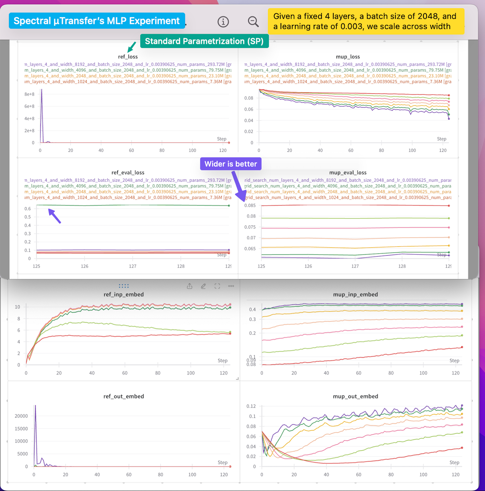

OpenAI's scaling laws [[link]](https://arxiv.org/abs/2001.08361) in 2020 has shown that scaling is one of the core ingredients for the success of LLMs. But naively stacking more layers can lead to unstable training due to exploding or vanishing gradients. In our implementation, the experimental results show that in a 350m llama, spectral µTransfer matches the pretraining performance of the baseline (albeit with a slightly higher training loss of 0.04). In another MLP-only experiment, µTransfer maintains a consistent L1 norm of activation across widths, and depths and allows scaling up to 2B while the SP baseline blows up and becomes untrainable.


# How to use Spectral µTransfer
In your Nanotron configuration, simply set `use_mup` to `true`. Nanotron will automatically determine the right standard deviation and learning rate for each parameter.


```diff
model:
  ...
  init_method:
-    std: 0.025
+    use_mup: true
```

# MLP Only Experiment

We ran a systematic experiment varying the number of layers from 8 to 32, width from 128 to 8192, and batch size from 32 to 2048, all on a logarithmic scale, CIFAR dataset, using an MSE training objective for 4 epochs with Adam optimizer. [[Experiment Report]](https://wandb.ai/neuralink/exp14_mup_grid_search/reports/-Spectral-Transfer-MLP-s-Experiment-Results--Vmlldzo3NDQ0NTQw?accessToken=xe0mkunx3y8t0xzbzxu9caqcre57or5la58d9o209hinanlmzoaj7es24m4elvdj)





# On 350m LLaMA

We trained a 350m model with spectral µTransfer and standard parametrization using Nanotron, a global batch size of 1m tokens at a learning rate of 0.001. µTransfer matches the performance of standard parametrization, with a slightly higher training loss of 0.04. [[Experiment Report]](https://api.wandb.ai/links/neuralink/i70nnpu9)

Please check the directory [[./examples/mup/configs]](/examples/mup/configs) for the configurations we used to reproduce the experiments.


#### Thoughts

For Spectral MuP, the experiments we used it on MLP only [link] and 300m LLaMA [link] (there are links to the experiment config in the mup readme). However, when we tested it on 1B/8B models iirc, the loss blew up for some reasons. So, we'd recommend they try μTransfer, not spectral μTransfer.
